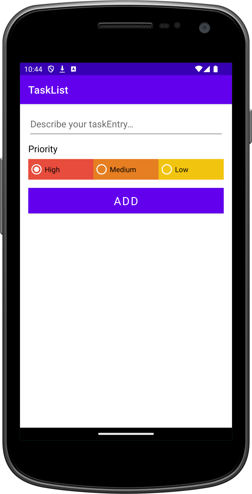
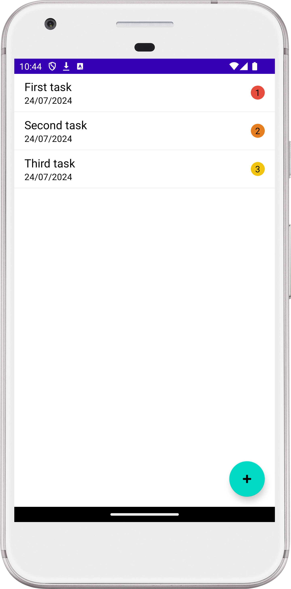

# TaskList App

A sample Android application demonstrating the use of Android Room database
for task management.

## Features:

- Add tasks with high, middle, or low priority
- Delete tasks by swiping left or right
- Simple and intuitive interface
- **Code Readability:** code is easily readable with no unnecessary blank lines,
  no unused variables
  or methods, and no commented-out code, all variables, methods, and resource
  IDs are descriptively
  named such that another developer reading the code can easily understand their
  function.

## Technologies Used:

- [Android](https://developer.android.com/studio/intro)
- [Kotlin](https://kotlinlang.org/)
- [Monolithic Architecture](https://en.wikipedia.org/wiki/Monolithic_architecture)
- AndroidX Room (room-ktx)
- View Model

## Getting Started:

1. Download the project
2. Open in Android Studio
3. Run on an emulator or Android device

## Usage:

- Use the app as a regular task manager
- Explore the code to learn about Android Room implementation

## Contributing:

Contributions are welcome! Create a pull request to the master branch.

## License:

No intentional license was used for this project.

## Contact:

Dmytro Turskyi

[dmytro@turskyi.com](mailto:dmytro@turskyi.com)

https://github.com/Turskyi

Note: Since this is a sample app, it's not intended for production use or
publication on Google Play.

## Screenshots:

<!--suppress CheckImageSize -->

